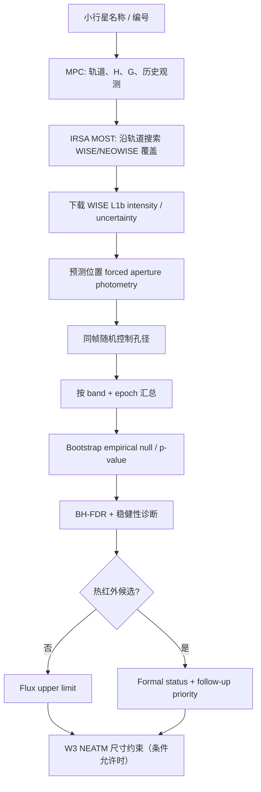
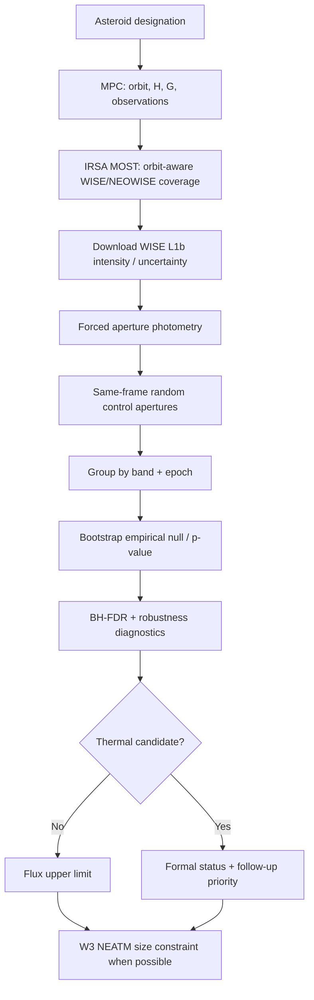

# WISE/NEOWISE Asteroid Miner

[简体中文](#简体中文) | [English](#english)


A conservative, orbit-aware Python pipeline for archival WISE/NEOWISE screening of MPC asteroids.

---

# 简体中文

## 项目简介

**WISE/NEOWISE Asteroid Miner** 是一个用于小行星历史红外数据筛查的科研型 Python 工具。给定 Minor Planet Center（MPC）支持的小行星名称、永久编号或临时编号，它可以沿目标轨道回溯 WISE/NEOWISE 历史观测，在预测位置执行 forced aperture photometry（强制孔径测光），使用同帧随机控制孔径建立经验背景噪声分布，并在条件允许时利用 W3 数据进行 NEATM 热模型尺寸约束。

项目的设计目标不是自动宣布“可靠探测”，而是提供一条**可复现、保守、适合后续人工验证的 archival screening pipeline**。

> **科学边界：** 本项目输出的 candidate、hint 或 follow-up priority 都属于筛查和诊断结果，不等同于经过独立验证的移动天体探测。用于论文级结论前，应进一步进行 shift-and-stack、背景源排查、伪轨道/null 检验、注入恢复测试或其他独立验证。

## 主要功能

- 通过 IRSA MOST 沿小行星轨道搜索 WISE/NEOWISE 历史覆盖。
- 下载并处理 WISE Merge Level-1b intensity 与 uncertainty 图像。
- 在轨道预测位置执行 forced aperture photometry，包括未进入点源目录的弱信号。
- 在同一帧上布置随机控制孔径，建立经验背景与 null distribution。
- 将观测按 WISE band 和 epoch 分组，并进行 bootstrap 统计分析。
- 在每个 band 内执行 Benjamini-Hochberg FDR 多重检验校正。
- 针对 W3/W4 自动检查附近 AllWISE 静止源污染。
- 将“正式热红外状态”和“后续研究优先级”分开处理。
- 对未显著探测的目标给出经验 flux upper limit。
- 在几何信息和 W3 数据可用时，通过 bandpass-integrated NEATM 估计或约束直径。
- 当 H 可用时生成 H–反照率–直径关系表。
- 保留原始响应、缓存、中间测光结果和汇总结果，方便复核与复现。

## 工作流程



## 环境要求

- Python **3.11+**
- 可访问互联网的环境，用于查询 MPC、IRSA MOST、WISE/AllWISE 数据服务
- 建议使用独立虚拟环境

## 快速开始

### 1. 克隆项目

```bash
git clone https://github.com/yizhizhangxiu/wise-neowise-asteroid-miner.git
cd wise-neowise-asteroid-miner
```

### 2. 创建虚拟环境并安装

Linux / macOS：

```bash
python3 -m venv .venv
source .venv/bin/activate
python -m pip install --upgrade pip
python -m pip install -e .
```

Windows PowerShell：

```powershell
py -3 -m venv .venv
.venv\Scripts\Activate.ps1
python -m pip install --upgrade pip
python -m pip install -e .
```

`.venv` 已加入 `.gitignore`，不应提交到仓库。

### 3. 创建目标配置

复制示例配置：

```bash
cp target.example.toml my_target.toml
```

Windows 用户可以直接复制 `target.example.toml` 并重命名为 `my_target.toml`。

最少需要指定：

```toml
[target]
designation = "2023 TP124"
```

`H` 和 `G` 可以手动填写，也可以省略；省略时程序会尝试从 MPC 获取。

### 4. 先检查历史覆盖

建议第一次运行先执行 coverage-only 模式：

```bash
python -m wise_miner my_target.toml --coverage-only
```

该模式主要检查轨道和 WISE/NEOWISE 历史覆盖，不会完整下载并测量所有 L1b FITS 图像，因此适合作为快速预检查。

### 5. 运行完整分析

```bash
python -m wise_miner my_target.toml
```

安装为 editable package 后，也可以使用：

```bash
wise-neowise-miner my_target.toml
```

兼容旧入口：

```bash
python run.py my_target.toml
```

## 配置说明

完整配置项请参阅：

- [配置参考 / Configuration reference](docs/CONFIGURATION.md)
- [示例配置 / Example configuration](target.example.toml)

几个重要默认参数：

```text
min_frames_candidate = 5
min_frames_strong    = 8
candidate_q          = 0.05
strong_q             = 0.01
candidate_snr        = 2.0
strong_snr           = 3.0
repeat_min_epochs    = 2
thermal_bands        = [3, 4]
```

默认分类逻辑刻意偏保守。重复性必须出现在**同一个 thermal band** 中；不同 band 的弱提示不会被简单拼接成“重复探测”。

## 输出结果

默认结果目录为：

```text
results/<target>/
```

优先查看以下文件：

```text
summary.json                 机器可读的目标级摘要
report.md                    人类可读分析报告
epoch_summary.csv            每个 band / epoch 的统计结果
band_coherence.csv           同一 band 跨 epoch 的一致性诊断
frame_photometry.csv         单帧测光结果
coverage.csv                 WISE/NEOWISE 历史覆盖
allwise_static_source_checks.csv
                             AllWISE 静止源污染检查
h_albedo_diameter.csv        H–反照率–直径换算
w3_neatm_results.csv         W3 NEATM 结果（若可用）
```

详细字段解释见 [输出参考](docs/OUTPUTS.md)。

## 当前正式状态标签

v1.2.x 的目标级 thermal status 包括：

```text
NO_SIGNIFICANT_THERMAL_DETECTION
W4_WEAK_SINGLE_EPOCH_CANDIDATE
TENTATIVE_W3_CANDIDATE
REPEATABLE_W3_CANDIDATE
REPEATABLE_W4_CANDIDATE
```

W1/W2 可能产生：

```text
DIAGNOSTIC_BAND_HINT
```

但 W1/W2 不会单独提升整体 thermal classification。低帧数异常还可能在 epoch 层面得到：

```text
LOW_N_HINT
```

项目还会独立给出 follow-up/coherence 信息，例如：

```text
Formal: NO_SIGNIFICANT_THERMAL_DETECTION
Follow-up: HIGH (W3_REPEATABLE_SUBTHRESHOLD)
```

这表示同一 band 的多个 epoch 中存在值得继续验证的亚阈值结构，**不代表正式探测**。

本项目不会自动输出：

```text
SECURE_DETECTION
```

## 统计方法概览

对每一张可用 WISE 图像，程序除了测量目标预测位置，还会在同一帧中放置多个随机控制孔径。目标测量会与控制孔径分布比较，从而尽量减少对理想高斯噪声假设的依赖。

在 epoch 层面，程序会使用控制孔径进行 bootstrap，构建经验 null distribution，并计算单侧经验 p-value。随后在同一 WISE band 内应用 Benjamini-Hochberg FDR 校正得到 q-value。

此外还会检查：

- positive-frame fraction
- effective sample size
- median / trimmed mean
- leave-one-out 稳定性
- 单帧最大权重
- 跨 epoch 同 band 一致性

这些诊断用于区分“多个独立帧共同支持的弱信号”和“由少量异常帧主导的表面显著性”。

## 热模型与尺寸约束

在 W3 数据和观测几何满足条件时，项目使用 NEATM（Near-Earth Asteroid Thermal Model）进行尺寸估计或上限约束。

模型会考虑：

- 直径 `D`
- 可见光几何反照率 `pV`
- 绝对星等 `H`
- 相位参数 `G`
- 日心距离 `r`
- 观测者距离 `Δ`
- 相位角
- beaming parameter `η`
- emissivity `ε`
- W3 relative spectral response

W3 模型采用 bandpass integration，而不是简单把 12 μm 当作理想单色测量。

如果没有显著探测，flux upper limit 和相应的尺寸上限通常比单纯的“未探测”标签更有科学价值。

## 使用的数据服务

实时运行会访问以下公开服务：

- Minor Planet Center（MPC）轨道与观测 API
- NASA/IPAC IRSA Moving Object Search Tool（MOST）
- WISE Merge Level-1b 数据集
- AllWISE Source Catalog
- W3 官方 relative spectral response 数据

上游 API、目录字段或服务行为可能发生变化。因此，项目会尽可能缓存原始响应和下载产品，便于后续审计和复现。

## 文档

- [使用说明](docs/USAGE.md)
- [配置参考](docs/CONFIGURATION.md)
- [输出参考](docs/OUTPUTS.md)
- [科学适用范围](docs/SCIENTIFIC_SCOPE.md)
- [架构说明](docs/ARCHITECTURE.md)
- [贡献指南](CONTRIBUTING.md)
- [更新记录](CHANGELOG.md)

## 测试与开发

运行回归测试：

```bash
python -m unittest discover -s tests -v
```

也可以检查 CLI：

```bash
python -m wise_miner --help
python -m wise_miner --version
```

GitHub Actions 会在 push 和 pull request 时针对受支持的 Python 版本运行安装、源码编译、CLI smoke test 和单元测试。

## 许可

本项目采用 [MIT License](LICENSE)。

Copyright (c) 2026 yizhizhangxiu

---

# English

## Overview

**WISE/NEOWISE Asteroid Miner** is a research-oriented Python pipeline for screening archival infrared observations of asteroids. Given an asteroid designation supported by the Minor Planet Center (MPC), it searches historical WISE/NEOWISE coverage along the object's orbit, performs forced aperture photometry at the predicted position, estimates an empirical background/null distribution from random control apertures on the same frame, and—when W3 data and observing geometry permit—derives conditional size constraints with NEATM.

The project is designed as a **reproducible and deliberately conservative archival-screening pipeline**, not as an automatic secure-detection system.

> **Scientific scope:** candidate labels, diagnostic hints, and follow-up priorities are screening results, not independently validated moving-object detections. Publication-grade claims should be supported by additional validation such as shift-and-stack analysis, static-source subtraction, pseudo-track/null tests, injection-recovery experiments, or other independent methods.

## Features

- Orbit-aware WISE/NEOWISE coverage search through IRSA MOST.
- WISE Merge Level-1b intensity and uncertainty image retrieval.
- Forced aperture photometry at the predicted moving-object position, including catalog non-detections.
- Same-frame random control apertures for empirical background and null estimation.
- Band/epoch grouping with bootstrap significance estimation.
- Within-band Benjamini-Hochberg false-discovery-rate correction.
- AllWISE static-source contamination checks for W3/W4 measurements.
- Separate **formal thermal status** and **follow-up priority** layers.
- Empirical flux upper limits for non-detections.
- Bandpass-integrated W3 NEATM size constraints when sufficient information is available.
- H–albedo–diameter tables whenever absolute magnitude H is available.
- Reproducible per-target output directories with cached upstream products and intermediate measurements.

## Pipeline



## Requirements

- Python **3.11+**
- Internet access for live MPC and IRSA queries
- A dedicated virtual environment is recommended

## Quick start

### 1. Clone the repository

```bash
git clone https://github.com/yizhizhangxiu/wise-neowise-asteroid-miner.git
cd wise-neowise-asteroid-miner
```

### 2. Create an environment and install

Linux / macOS:

```bash
python3 -m venv .venv
source .venv/bin/activate
python -m pip install --upgrade pip
python -m pip install -e .
```

Windows PowerShell:

```powershell
py -3 -m venv .venv
.venv\Scripts\Activate.ps1
python -m pip install --upgrade pip
python -m pip install -e .
```

The local `.venv` directory is ignored by Git and should not be committed.

### 3. Create a target configuration

Copy the example configuration:

```bash
cp target.example.toml my_target.toml
```

On Windows, copy `target.example.toml` and rename the copy to `my_target.toml`.

At minimum, specify:

```toml
[target]
designation = "2023 TP124"
```

`H` and `G` are optional. If omitted, the pipeline attempts to obtain them from MPC.

### 4. Check archival coverage first

A coverage-only run is recommended for the first pass:

```bash
python -m wise_miner my_target.toml --coverage-only
```

This checks the orbit and historical WISE/NEOWISE coverage without performing the full L1b image measurement workflow.

### 5. Run the full pipeline

```bash
python -m wise_miner my_target.toml
```

After editable installation, the equivalent console command is:

```bash
wise-neowise-miner my_target.toml
```

Legacy compatibility entry point:

```bash
python run.py my_target.toml
```

## Configuration

See:

- [Configuration reference](docs/CONFIGURATION.md)
- [Example configuration](target.example.toml)

Important defaults include:

```text
min_frames_candidate = 5
min_frames_strong    = 8
candidate_q          = 0.05
strong_q             = 0.01
candidate_snr        = 2.0
strong_snr           = 3.0
repeat_min_epochs    = 2
thermal_bands        = [3, 4]
```

The default logic is intentionally conservative. Repeatability must occur in the **same thermal band**; weak evidence from different bands is not simply combined into a repeatable detection label.

## Outputs

Results are written under:

```text
results/<target>/
```

The most useful files to inspect first are:

```text
summary.json                 Machine-readable target summary
report.md                    Human-readable analysis report
epoch_summary.csv            Per-band/per-epoch statistics
band_coherence.csv           Same-band cross-epoch coherence diagnostics
frame_photometry.csv         Per-frame photometry
coverage.csv                 Historical WISE/NEOWISE coverage
allwise_static_source_checks.csv
                             AllWISE static-source contamination checks
h_albedo_diameter.csv        H–albedo–diameter conversion table
w3_neatm_results.csv         W3 NEATM results when available
```

See [Output reference](docs/OUTPUTS.md) for detailed field definitions.

## Formal status labels

Current v1.2.x target-level thermal labels are:

```text
NO_SIGNIFICANT_THERMAL_DETECTION
W4_WEAK_SINGLE_EPOCH_CANDIDATE
TENTATIVE_W3_CANDIDATE
REPEATABLE_W3_CANDIDATE
REPEATABLE_W4_CANDIDATE
```

W1/W2 may produce:

```text
DIAGNOSTIC_BAND_HINT
```

but do **not** promote the overall thermal classification by themselves. Low-frame-count excursions may receive the epoch-level label:

```text
LOW_N_HINT
```

A separate coherence layer can produce follow-up information such as:

```text
Formal: NO_SIGNIFICANT_THERMAL_DETECTION
Follow-up: HIGH (W3_REPEATABLE_SUBTHRESHOLD)
```

This means repeated same-band sub-threshold structure is worth independent follow-up; it is **not** a formal detection.

The pipeline deliberately never emits:

```text
SECURE_DETECTION
```

## Statistical approach

For each usable WISE frame, the pipeline measures the predicted target position and also places multiple random control apertures on the same image. The target measurement is evaluated relative to the control-aperture distribution, reducing reliance on an idealized Gaussian-noise assumption.

At the epoch level, control-aperture measurements are bootstrapped to construct an empirical null distribution and a one-sided empirical p-value. Benjamini-Hochberg FDR correction is then applied within each WISE band to obtain q-values.

Additional robustness diagnostics include:

- positive-frame fraction
- effective sample size
- median and trimmed mean
- leave-one-out stability
- maximum single-frame weight
- same-band cross-epoch coherence

These checks help distinguish a weak signal supported by many independent frames from an apparent excess dominated by one or a few problematic measurements.

## Thermal modeling and size constraints

When W3 measurements and observing geometry are suitable, the project uses the Near-Earth Asteroid Thermal Model (NEATM) to estimate or constrain asteroid size.

The model includes quantities such as:

- diameter `D`
- visible geometric albedo `pV`
- absolute magnitude `H`
- phase parameter `G`
- heliocentric distance `r`
- observer distance `Δ`
- phase angle
- beaming parameter `η`
- emissivity `ε`
- the W3 relative spectral response

The W3 model is integrated over the bandpass rather than treating 12 μm as an ideal monochromatic measurement.

For non-detections, empirical flux upper limits and the corresponding conditional diameter limits can be more informative than a simple “not detected” label.

## External data services

Live runs rely on public services from:

- Minor Planet Center (MPC) orbit and observation APIs
- NASA/IPAC IRSA Moving Object Search Tool (MOST)
- WISE Merge Level-1b products
- AllWISE Source Catalog
- official W3 relative spectral response data

Upstream APIs, schemas, and service behavior can change. The pipeline therefore caches raw responses and downloaded products where practical to improve auditability and reproducibility.

## Documentation

- [Usage guide](docs/USAGE.md)
- [Configuration reference](docs/CONFIGURATION.md)
- [Output reference](docs/OUTPUTS.md)
- [Scientific scope](docs/SCIENTIFIC_SCOPE.md)
- [Architecture overview](docs/ARCHITECTURE.md)
- [Contributing](CONTRIBUTING.md)
- [Changelog](CHANGELOG.md)

## Development and tests

Run the regression test suite with:

```bash
python -m unittest discover -s tests -v
```

CLI checks:

```bash
python -m wise_miner --help
python -m wise_miner --version
```

GitHub Actions runs installation, source compilation, CLI smoke tests, and unit tests on supported Python versions for pushes and pull requests.

## License

This project is released under the [MIT License](LICENSE).

Copyright (c) 2026 yizhizhangxiu
